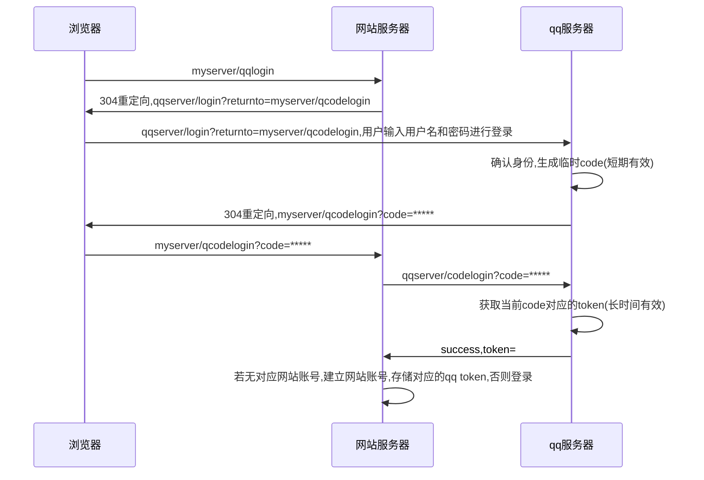

网站加个用qq登录的功能,就得用这个
看了https://www.cnblogs.com/flashsun/p/7424071.html记录一下

要素
- 浏览器
- 网站服务器 myserver
- qq服务器  qqserver

### code与token的不同
一个qqtoken唯一对应一个qq账号,所以网站可以通过验证qqtoken来确定用户的身份,而code是临时的,即使在用户手里被窃取,很短时间后就不能用了