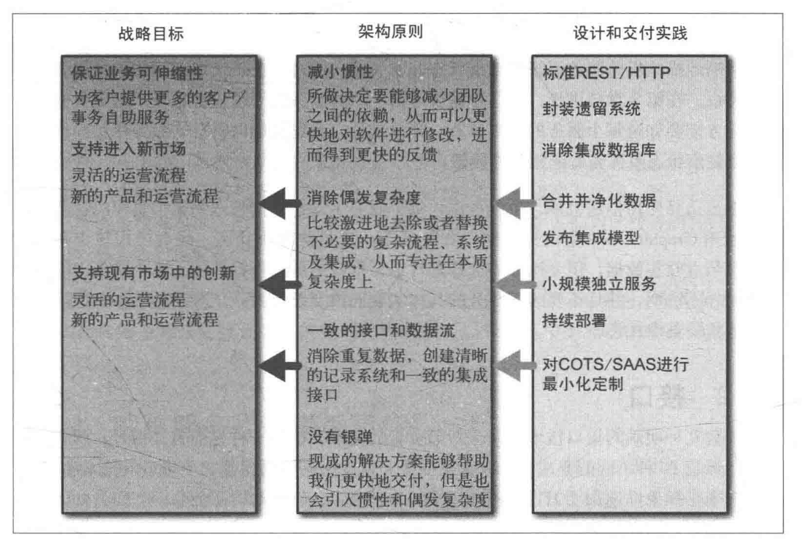

# 第一章 微服务

```
关于微服务概念性的介绍
```
## 1.1 什么是微服务

- 足够小，小到大家不认为它过大，导致修改困难即可
- 自治性，采用进程间通信而非进程内通信的方式交换信息和调用API，每个服务运行在不同的进程，甚至不同的机器，服务间耦合很小，生命周期也不耦合


## 1.2 微服务优势

- 技术异构性：由于采用进程间通信来实现API，所以进程内是怎么实现API的，使用什么语言，什么框架都不重要，都可替换，就可以尝试新技术
- 弹性：微服务部分挂掉并不会导致整体不可用，因为进程是分开的，但同时带来了分布式系统的问题，网络故障，机器故障等
- 扩展：当某个服务性能不足，可以只给它加机子，单块应用就不行
- 简化部署：编译快，上线快，修改相对封闭，不易出错，所以开发就快了
- 与组织结构匹配：小团队，小服务，管理，沟通代价下降，效率更高
- 可组合性：一份逻辑，四处用，桌面端，移动端都能用
- 可替代性优化：删除一个过时的服务时不再心惊胆战，因为逻辑分解已经清晰可见


## 1.3 面向服务的架构


微服务可以看做是SOA的一种实现方式

## 1.4 与其他分解技术的比较

- 共享库：不异构，静态链接库部署慢，共享代码用于业务通信则成为耦合点
- 模块：很多语言的模块功能比较弱，麻烦，例如java的OSGI，单进程容易让人想偷懒，不模块化

# 第二章 演化式架构师

```
关于微服务中架构师职责的变化
```

## 2.1 2.2 软件架构师与传统行业对等人员的不同


传统行业：收集大量信息，设立详细的计划和完善的方案（强调准确和稳定性，因为产品难以变更）
软件架构师：划分区域，建立框架和原则，指导性的原则，带来可演化的系统（强调变化，因为软件需求变太多）

## 2.3 分区

把业务按较粗的粒度划分服务边界

少关注区域内：区域内技术栈选择相对自由，但技术栈也不要过多，以便招聘和团队间交换成员

多关注区域间：区域间通信相对统一，否则服务消费者需要支持所有的消息类型

```
架构师应当和轮流和各个团队一起工作，增强沟通，以使其设计的架构对开发人员友好
```

## 2.4 一个原则性的方法


### 2.4.1-3 战略->原则->实践
战略一般是部门级别和业务部门的事，架构师很少参与制定，但应当了解，以便使技术选择与战略相一致

原则一般是较模糊和笼统的建议（应该如何如何），与其相似的是约束，但约束的变化频率很低，原则和约束加起来不要太多，以便记忆，10条左右

实践一般和具体的技术直接相关

例子


原则和实践最好不只是文档，给出具体的代码例子更易让开发人员理解

### 2.4.4 原则与实践
原则和实践并没有严格的分界，持久不变的实践可以转化为原则，而如果一个原则在多个团队的实践有多种形式则不行

## 2.5 要求的标准 ---- 在不同的微服务之间的统一点

- 监控：统一的监控，日志系统使得系统级的故障分析更便捷
- 接口：统一的接口标准，而且在细节上也尽可能一致，这样新消费者集成更容易
- 架构安全性：统一的故障处理使得错误易于追溯，每个模块都应该处理下游的错误请求，使得系统更强健

## 2.6 代码治理

- 范例：文档要附带真实的代码例子，使得实践者不易犯错
- 裁剪服务代码模板：抽取公共的，长久一致的开发实践做出模板，降低错误风险，减少工作量
  - 由于增大了新增技术栈的代价（建立新模板），所以相对而言限制了技术栈爆炸
  - 框架功能不要过多以强行满足所有人，否则反而降低团队效率
  - 模板引进了代码耦合，模板代码的更新是困难的

## 2.7 技术债务

- 赶业务时间，违背愿景
- 系统目标变化

架构师的作用
- 理解债务的层次和对系统的影响，做出权衡
- 提供温和的指导来告诉团队如何应对债务（放权型）
- 维护债务列表，定期回顾（集权型）

## 2.8 例外管理
有时原则和实践被违反，记录下来，如果频率很高，考虑改变原则和实践

## 2.9 集中治理和领导

架构师个人难以支撑工作，所以建立治理小组，带领和培养治理小组，在犯严重错误时进行阻止，但大多数时间放权

## 2.10 建设团队
带领整个团队理解愿景，成长为独当一面的大佬

