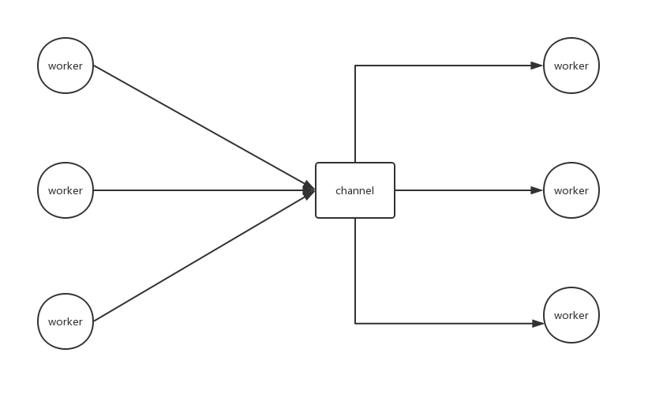

http://tutorials.jenkov.com/java-concurrency/index.html

## 为什么并发
并发优势
- 更好的利用多核cpu
- 等待io时干别的
- 天然逻辑并发的任务分割更优雅

并发劣势
- 系统调度开销,上下文切换开销
- 共享状态实现难
- 错误处理难(上下文丢失)

## 并发模型

### 并行多workers,一个任务切分给多个worker同时干
```
           |---> worker
delegator--|---> worker
           |---> worker
```
- 优点:利用多核,等待io时别的线程调度上来继续工作
- 缺点:多线程通信,共享状态困难,竞争,死锁问题

### 顺序多worker,流水线模型

```
worker --> 非阻塞io yield --> worker
这就是async await那一套嘛,实质上并不是并发的,worker是顺序执行的
但是yield的时候,这一条流水线都yield了,别的线程可以抢占嘛
```
worker之间并不共享状态,而且也不并行执行


### 混合模型

混合模型就是全局有序,但是部分分叉,或者全局分叉,部分有序这样

### Actor模型(推模型)

所有worker都有自己的消息队列,可以调用其send方法向其发送消息,每个worker都在处理自己消息队列里的消息,worker之间也可以互相发送消息,不过消息队列得加锁

### Channel模型
更灵活,消息队列独立于worker,可以有多个worker向其发送消息,而多个worker监听channel并接收消息



## 线程安全
什么不是线程安全的
- 多线程共享
- 非只读
- 资源(内存,数据库,文件...)

