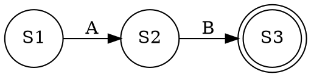
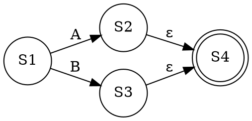
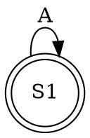
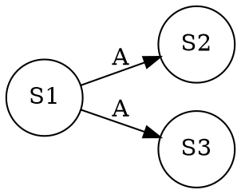
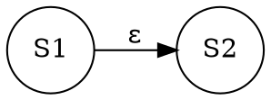

# 词法分析

把程序中的每个不可分割的最小单位，变成方便程序使用的对象(称作token)，扔掉多余的空格，注释什么的

统一的格式{符号类型，符号具体内容}

这样后面的分析中就可以用一个统一的对象集合来处理语句了，而不用考虑很多字符串处理中的复杂问题

把符合一定规则的字符串变成对象,`规则`就是我们定义的`单词`

定义字符串匹配规则,最常见的做法是正则表达式,简洁方便

## 正则表达式
单个的字符是正则表达式,对于两个正则表达式A,B
```
AB      两个正则表达式紧接着出现
A|B     出现任意一个
A*      不出现或出现任意多次
都是正则表达式
还有一个方便的表示A+ = AA* 出现一次或任意多次
```

当然,什么是合法的字符,我们也需要定义

## 实现正则表达式引擎
如何去使用正则表达式匹配字符串,则又是一个问题

我们可以使用自动机表示当我们读进一个字符之后的状态转换,直到读进了一个单词,我们就把单词扔进对象集合,然后去读下一个单词

只要处理了最简单的正则表达式情况即可,复杂的情况只是简单情况的组合

AB


A|B


A*


其中双圈表示结束状态,可以获得单词了,ε表示啥也没有(空边)

人类整理出的状态机通常不是最简形式,存在

重边(吃进相同东西,有多条路可走)

空边



这些程序里都没法实现的,所以称作NFA,非确定有限状态自动机,所以需要化简.

实际上一个状态和它走空边能到达的状态本质是一个状态,所以合并之

一个状态吃进相同东西能到达的状态本质是一个状态,所以合并之

不同结束状态输出不同的单词,所以不是相同的,所以不能合并

所以从初始状态出发,按照这个规则,吃进相同字符能到达的节点集合则合并成一个状态,从这个集合吃进相同字符能到达的状态集合合并成一个状态,一次类推,最后就获得了最简的状态集合,及其转换关系,称作DFA,确定有限状态自动机

确定有限自动状态自动机就可以使用程序实现了,本质上是个有向图,可以使用邻接矩阵的形式实现,即状态转换表格,也可以把状态转换硬编码在代码里.